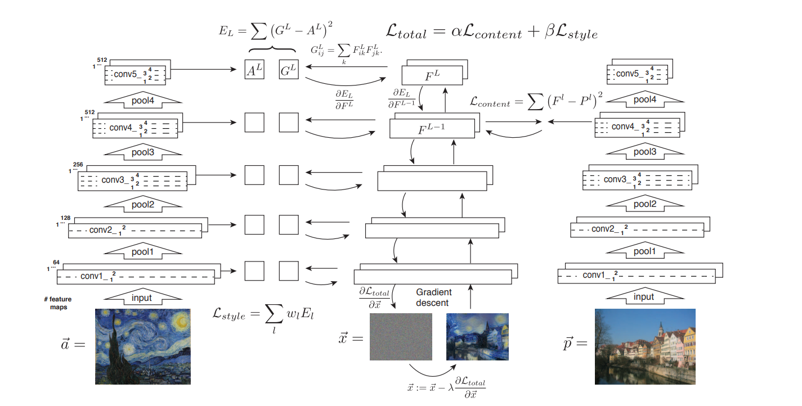
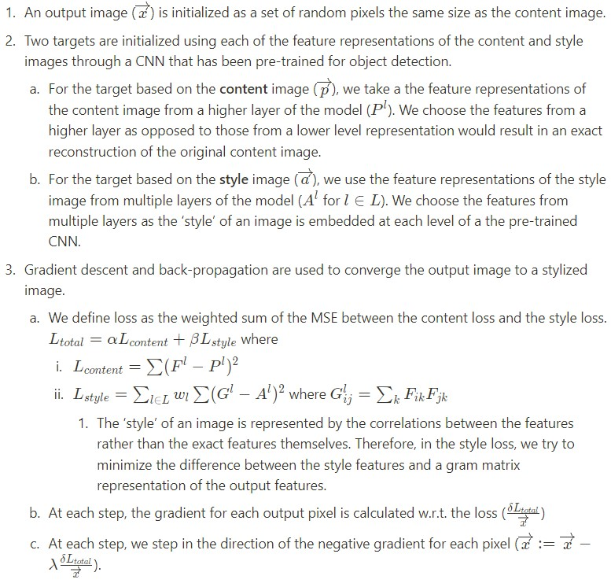

# Better Neural Style Transfer
## Introduction
This project aims to replicate the work of [Gatys et al.](https://www.cv-foundation.org/openaccess/content_cvpr_2016/papers/Gatys_Image_Style_Transfer_CVPR_2016_paper.pdf) 
on using neural nets to perform **texture style transfer** from one image to another while discovering insights into the performance of the transfer process across various CNNs.
### Image Style Transfer Background
Image style transfer is the process of superimposing the artistic style of a *source image* 
onto another *target image* to generate a new *stylized image*, thereby **transferring the style** of the *source 
image*.

As described in the original paper by [Gatys et al.](https://www.cv-foundation.org/openaccess/content_cvpr_2016/papers/Gatys_Image_Style_Transfer_CVPR_2016_paper.pdf),
transferring the style from one image onto another can be considered a problem of texture transfer, a well-researched 
concept where the SOTA methods prior at the time, while achieving remarkable results, used only low-level image features of 
the target image to inform the texture transfer.

Gatys et al. proposed a novel algorithm that leverages image representations derived from Convolutional Neural Networks (CNN) 
optimised for object recognition, which make high level image information explicit. We refer to this technique as **Neural Style Transfer**.

### Neural Style Transfer (NST)
The NST algorithm leverages image representations derived from deep layers in an image recognition CNN and then use them 
to inform the style transfer process. Broadly, tt involves the following key steps:
- Extract image representations from deep convolutional layers of an image recognition CNN from both the *target* 
(hereon referred to as the *content* image) and the *style* image.
- Converge a white noise image towards the *stylized* image using losses derived cumulatively from both, the style and content representations.

## Algorithm





## Usage
### Setup

1. Open Anaconda Prompt and navigate into project directory `cd path_to_repo`
2. Run `conda env create` (while in project directory)
3. Run `activate pytorch-nst

### Basic
Specify the *content* and *style* images from the respective directories in the `data` directory.
<p align="center">


</p>
python neural_style_transfer.py --content_img_name <content-img-name> --style_img_name <style-img-name>
```


### Advanced
- **Specify which model to use and weights for style and content images**
```shell

```
