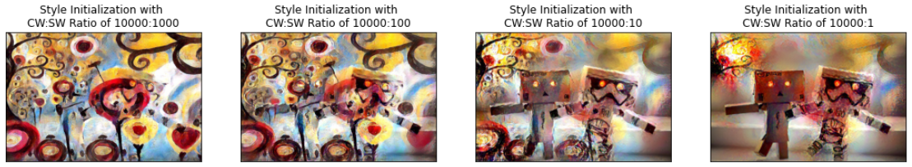

# Better Neural Style Transfer
## Introduction
This project aims to replicate the work of [Gatys et al.](https://www.cv-foundation.org/openaccess/content_cvpr_2016/papers/Gatys_Image_Style_Transfer_CVPR_2016_paper.pdf) 
on using neural nets to perform **texture style transfer** from one image to another while discovering insights into the performance of the transfer process across various CNNs.
### Image Style Transfer Background
Image style transfer is the process of superimposing the artistic style of a *source image* 
onto another *target image* to generate a new *stylized image*, thereby **transferring the style** of the *source 
image*.

As described in the original paper by [Gatys et al.](https://www.cv-foundation.org/openaccess/content_cvpr_2016/papers/Gatys_Image_Style_Transfer_CVPR_2016_paper.pdf),
transferring the style from one image onto another can be considered a problem of texture transfer, a well-researched 
concept where the SOTA methods prior at the time, while achieving remarkable results, used only low-level image features of 
the target image to inform the texture transfer.

Gatys et al. proposed a novel algorithm that leverages image representations derived from Convolutional Neural Networks (CNN) 
optimised for object recognition, which make high level image information explicit. We refer to this technique as **Neural Style Transfer**.

### Neural Style Transfer (NST)
The NST algorithm leverages image representations derived from deep layers in an image recognition CNN and then use them 
to inform the style transfer process. Broadly, tt involves the following key steps:
- Extract image representations from deep convolutional layers of an image recognition CNN from both the *target* 
(hereon referred to as the *content* image) and the *style* image.
- Converge a white noise image towards the *stylized* image using losses derived cumulatively from both, the style and content representations.

## Algorithm


## Usage
### Setup

1. Open Anaconda Prompt and navigate into project directory `cd path_to_repo`
2. Run `conda env create` (while in project directory)
3. Run `activate pytorch-nst

### Basic
Specify the *content* and *style* images from the respective directories in the `data` directory.
<p align="center">


</p>

```shell
python neural_style_transfer.py --content_img_name <content-img-name> --style_img_name <style-img-name>
```


### Advanced
- **Specify the model and weights**
```shell
python neural_style_transfer.py --content_img_name now_youre_in_new_york.jpg --style_img_name mosaic.jpg --model vgg16 --content_weight 1000000 --style_weight 20000
```


- **Specify the layer configurations**
```shell
python neural_style_transfer.py --content_img_name figures.jpg \
              --style_img_name candy.jpg \
              --model inceptionV3 \
              --content_layer 4 \
              --style_layers 6
```

## Experiments
### Testing different image initializations
The choice of initialization influenced the final output significantly. Our expectation was that all of these choices 
would have converged to the same or a similar image given enough iterations, however, we found that the algorithm 
converged to local minima. We tested the following initializations
- Content
- Style
- Random Gaussian
- Random Uniform
With the following output (left to right respectively)

![Figure 1: (Far left) Trained output using initialization of the output image as the content image. (Middle left) Trained output using initialization of the output image as a resized version of the style image. (Middle right) Trained output using initialization of the output image as a Gaussian initialization with mean 0 and standard deviation 1 of the size of the content image. (Far right) Trained output using initialization of the output image as a random uniform initialization between -1 and 1.](images/nst_initializations.jpg)
*Figure 1: (Far left) Trained output using initialization of the output image as the content image. (Middle left) Trained output using initialization of the output image as a resized version of the style image. (Middle right) Trained output using initialization of the output image as a Gaussian initialization with mean 0 and standard deviation 1 of the size of the content image. (Far right) Trained output using initialization of the output image as a random uniform initialization between -1 and 1.*

Of these 4 initializations, the content initialization resulted in the only stylized output that was desirable.

### Testing different weights for the loss functions
In the following experiments, we kept *content weight* (alpha) fixed at 10,000 and varied *style weight* (beta). For the runs 
**initialized with a resized style image**, 4 *style weights* were tested from 1,000 to 1.

*Figure 2: Stylized images when initialized with the resized style image and trained with differing ratios of content loss and style loss.*

With the stylized images **initialized with style**, a alpha-beta ratio of 10,000 to 10 appeared the best. The structure of the content image is clear and there are traces of the style image, however, the appearance of the style features are clustered and separate from the content features. Overall, even after manipulating the relative weights of the content and style losses, all stylized images initialized with style failed to converge to a good image.

For the runs **initialized with a random noise** image, 4 *style weights* were tested from 10,000 to 10.

*Figure 3: Stylized images when initialized with Gaussian random noise and trained with differing ratios of content loss and style loss.*

With the stylized images **initialized with random noise**, a alpha-beta ratio of 10,000 to 10 appeared the. The structural content is present, although the outlines of the figures are not well-defined, and there is a clear and constant blend of the style features. The quality of this final image is comparable to the quality of the content initialized image.

### Testing different layers from which to get feature representations
- Each layer in a CNN contains different representations of the original image. 
- Generally, the features each node corresponds to become more granular and abstract as the layers go deeper into the network. 
- We hypothesized that from which layers the feature representations were taken, for both the content features and the 
style features, would influence the quality of the output image. 
- We tested getting the content features from the 1st, 3rd, 4th (default), and 5th convolutional layers.

*Figure 4: Changing the conv layer we got the content features from. We tested layers 1, 3, 4 (default), and 5.*
  - Varying the layer we extracted the content features from had minimal impact on the stylized output image. 
  - This was an interesting finding and differed from the original paper which suggested features from lower 
  convolutional layers would bias the stylized output image towards the original content image, whereas in our 
  investigations it made no difference.

  - We also tested getting the style features from all convolutional layers up to the 1st, 2nd, 3rd, 4th, 5th, and 6th (default) layer.
  
  *Figure 5: Changing the max conv layer we got the style features from. We tested up to layers 1, 2, 3, 4, 5, 6*
  - Varying the layers from which we extracted the style features made a significant impact on the stylized output image. 
  - When taking features from layers 1 and 2 only, the model failed to learn and remained stuck on the original content image initialization. 
  - When taking features from layer 1 only or layers 1, 2, 3 only, the final output resulted in weak transfer of style where some of the color palette transferred but little of the style image texture transferred. 
  - We observe that the features from layer 4 and up are the most crucial for the transfer of the style image texture that makes style transfer visually interesting.

### Testing different CNN architectures to get content/style representations from
We tested implementing the style transfer algorithm with PyTorch’s pretrained ResNet50 and InceptionV3 models. 
For each of these models, we needed to tune from which layers to extract the content feature targets and style feature targets.


*Figure XX: Stylized images where the content and style feature targets were obtained from various models. (Left) Features extracted from VGG19 (the paper’s original model). (Middle) Features extracted from ResNet50. (Right) Features extracted from Inception V3.*

- Both ResNet50 and InceptionV3 generated stylized output images, however, based on our evaluation heuristics, they were not as good as with VGG19. 
- Like with VGG19, the stylized output images of ResNet50 and InceptionV3 both clearly show the content image objects and they also adopt the style image color palette, however, they fail to meet the third heuristic which was adoption of the style image texture palette. 

Although the ResNet50 and InceptionV3 outputs fall short of the quality of the VGG19 output, **we acknowledge we may not 
have perfectly tuned either of these new models** to extract the content and style features from the optimal layers or 
perfectly set the content and style weight losses.

## Acknowledgements
### Useful Repositories
- [pytorch-neural-style-transfer](pytorch-neural-style-transfer)
- [fast_neural_style](https://github.com/pytorch/examples/tree/master/fast_neural_style) (PyTorch, feed-forward method)

### References
- Gatyls et al., [Image Style Transfer Using Convolutional Neural Networks](https://www.cv-foundation.org/openaccess/content_cvpr_2016/papers/Gatys_Image_Style_Transfer_CVPR_2016_paper.pdf)
- [Neural Style Transfer Using PyTorch](https://towardsdatascience.com/implementing-neural-style-transfer-using-pytorch-fd8d43fb7bfa)